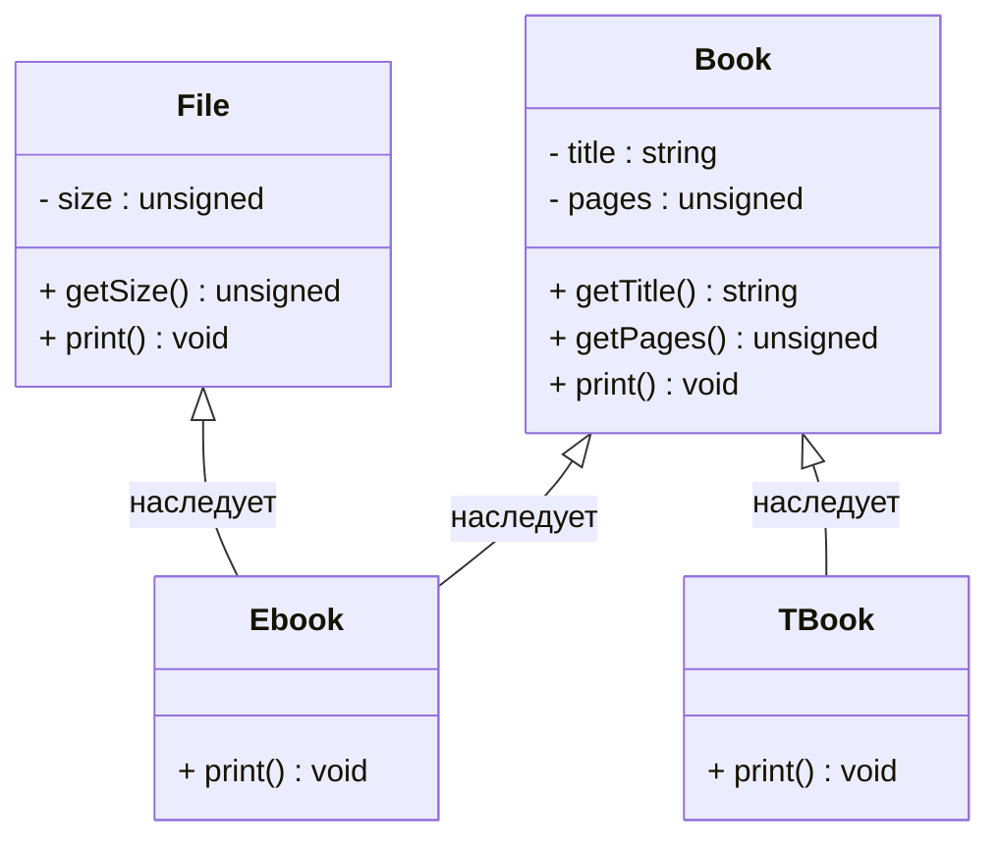

## Расскажи, как работает механизм исключений.

`throw` создаёт объект исключения и передаёт управление подходящему `catch` в ближайшем охватывающем `try`. При выходе из вызовов до обработчика раскручивается стек: уничтожаются созданные локальные объекты. Обработчики проверяются по порядку. Если подходящего обработчика нет или исключение выходит из `noexcept`-функции, вызывается `std::terminate`. `throw;` внутри обработчика повторно бросает текущее исключение.

```cpp
#include <iostream>
#include <stdexcept>
#include <string>

void work() {
    std::string resource = "data";
    throw std::runtime_error("failure");
} // resource уничтожается при раскрутке стека

int main() {
    try {
        work();
    } catch (const std::exception& e) {
        std::cout << e.what() << '\n';
    }
}
```

Исключения обычно ловят по `const`-ссылке, чтобы избежать копирования и срезки типа. После обработки выполнение продолжается после конструкции `try/catch`, а не с места `throw`. Перед `std::terminate` при отсутствии обработчика или нарушении `noexcept` полная раскрутка стека не гарантируется.

## Когда нужно использовать исключения, а когда коды ошибок?

Причины использовать код ошибки или исключения могут быть современно разные.

Причины использования кодов ошибки:
1) Есть четкое соотношение между кодом ошибки и состоянием программы, то есть код ошибки обрабатывается непосредственно рядом с вызовом
**Пример**
```C++
ErrorEnum foo(int x) {
  if (x > 10) {
    return ErrorEnum::ERROR;
  }
  return ErrorEnum::OK;
}
```
2) Логика, при котором функция возвращает код ошибки является нормальным поведением программы
3) Современный `C++23` предлагает `std::expected<Value, CodeError>` для возврата ошибок
**Пример:**
```C++
std::expected<DatabaseRecord, ErrorCode> findRecord(Database &db,
                                                      int recordId) {
  if (!db.connected())
    return std::unexpected(ErrorCode::BAD_CONNECTION);

  auto record = db.query(recordId);
  if (record.valid)
    return record;

  return std::unexpected(ErrorCode::NOT_FOUND);
}
```

**Например**
Функция возвращает `-1` если в массиве не было найдено необходимого числа

Причины использования исключений:
1) Есть четкое разделение на логику выбрасывания исключений и единую точку обработки исключений
**Пример**
```C++
int main() {
  try {
    foo(10);
  } catch (const Error1& e) {
    ...
  }
  catch (const Error2& e) {
    ...
  }
  return 0;
}
```
2) Операция не может выполнить свой контракт. Исключение позволяет передать ошибку вызывающему коду, который может восстановиться; завершение всей программы необязательно.
**Пример**
```C++
int foo(int x) {
	if (x < 10) {
		throw std::invalid_argument("Ой ой ой...");
	}
	...
}
```
3) Исключения особенно полезны, когда между функцией, которая вызывает ошибку и функцией, которая ее обрабатывает несколько уровней вложенности
**Пример:**
```
try {
	a(); // a() {b();} -> b() {c();} -> c() {d();} -> d() {throw Exception();}
}
catch (const Exception& e) {
	...
}
```

## Расскажи об иерархии расположения catch-блоков

В C++ эталонная иерархия catch-блока выглядит следующим образом:
```C++
int main() {
  try {
    ...
  } catch (const std::invalid_argument &e) {
    ... // Исключение входных аргментов и параметров
  } catch (const std::runtime_error &e) {
    ... // Исключения работы приложения в runtime
  } catch (const std::exception &e) {
    ... // Стандартные исключения и все, что унаслелованы от него
  } catch (...) {
    ... // Все исключения, в т.ч и throw 1 throw "dsds"
  }
  return 0;
}
```

Обработка ошибок должна начинаться с наиболее узкоспециализированных ошибок и идти к наиболее общим. Так, например, `std::invalid_argument` и `std::runtime_error` наследуются от `std::exception`, если они будут указаны после блока `std::exception`, то блоки ***НИКОГДА*** не будут вызваны.

Отметим, что `catch (...)` особенный случай, так как отлавливает абсолютно все исключения и не дает доступа к объекту исключения. Он должен располагаться всегда в самом низу иерархии блоков `catch`. Использовать его необходимо грамотно тогда, когда это действительно необходимо.
Например, программа выполняет работу и не должна завершаться аварийно, она должна при ошибках вернуть код ошибки. `catch (...)` так же уместен на верхней границы приложения, чтобы залогировать факт некорректной работы программы

## Можно ли бросать исключение из конструктора? О чем нужно помнить, когда мы бросаем исключения из конструктора?

Из конструктора **можно** бросать исключение, но деструктор недостроенного объекта вызван не будет. Уже полностью созданные поля и базовые подобъекты уничтожаются автоматически.
Факт того, что деструктор класса вызван не будет требует, чтобы поля класса соблюдали идеому `RAII` , чтобы избежать утечки памяти. Не следует использовать сырые указатели, если заранее есть понимание, что конструктор может выбросить исключение.

**Например**
```C++
class B {
public:
  B() { std::cout << "B()" << std::endl; }

  ~B() { std::cout << "~B()" << std::endl; }
};

class A {
private:
  B b_;

public:
  A() {
    std::cout << "A()" << std::endl;
    throw std::runtime_error("A");
  }

  ~A() { std::cout << "~A()" << std::endl; }
};


// mian.cpp
try {
	A();
} catch (const std::exception& e) {
	...
}
```
```bash
B()
A
~B()
```
Бросать исключение из конструктора нормально еще по тому, что не бывает "частично" корректных объектов, если конструктор не может создать корректный объект - он обязан выбросить исключение.

## Можно ли бросать исключение из деструктора?

Формально бросить исключение можно, но выпускать его из деструктора не рекомендуется. Деструктор по умолчанию `noexcept(true)`, если деструкторы баз и полей не являются потенциально бросающими. Выход исключения из `noexcept`-функции вызывает `std::terminate`; бросить и перехватить его внутри функции можно.

**Пример**
```C++
class A {
public:
  A() { std::cout << "A()" << std::endl; }

  ~A() {
    std::cout << "~A()" << std::endl;
    throw std::runtime_error("A");
  }
};

// main.cpp
try {
	auto a = A();
} catch (const std::runtime_error &e) {
	std::cout << e.what() << "\n";
}
```
```bash
A()
~A()
terminate called after throwing an instance of 'std::runtime_error'
  what():  A
Аварийный останов (образ памяти сброшен на диск)
```

Можно явно указать `noexcept(false)`, но если исключение выйдет из деструктора во время раскрутки стека из-за другого исключения, вызовется `std::terminate`. Перехваченное внутри деструктора исключение само по себе к этому не приводит.
**Пример**
```C++
class A {
public:
  A() { std::cout << "A()" << std::endl; }

  ~A() noexcept(false) {
    std::cout << "~A()" << std::endl;
    throw std::runtime_error("A");
  }
};

int foo() {
  std::cout << "foo()" << std::endl;
  throw std::runtime_error("11");
  return 1;
}

int main() {
  try {
    auto a = A();
    foo();
  } catch (const std::runtime_error &e) {
    std::cout << e.what() << "\n";
  }
  return 0;
}
```
```
A()
foo()
~A()
terminate called after throwing an instance of 'std::runtime_error'
  what():  A
Аварийный останов (образ памяти сброшен на диск)
```

## Что произойдет, если dynamic_cast не сможет скастовать тип?

`dynamic_cast` по разному себя ведет с ссылками и указателями. Для ссылок - выбрасывание исключения `std::bad_cast`, а для указателей вернёт `nullptr`
Для проверяемого downcast/cross-cast исходный тип должен быть полиморфным, например иметь виртуальный деструктор. Ниже предполагается, что `Book` удовлетворяет этому условию.

**Например**
Иерархия объектов:

Код с указателем:
```C++
int main() {
  Ebook cppbook{"About C++", 350, 6};
  Book *book = &cppbook;
  auto x = dynamic_cast<TBook *>(book);
  if (x != nullptr) {
    std::cout << "x is not nullptr" << std::endl;
    return 0;
  }
  std::cout << "x is nullptr" << std::endl;
  return 0;
}
```
```
x is nullptr
```
Код с ссылкой:
```C++
int main() {
  Ebook cppbook{"About C++", 350, 6};
  Book& book = cppbook;
  auto& x = dynamic_cast<TBook&>(book);
  return 0;
}
```
```
terminate called after throwing an instance of 'std::bad_cast'
  what():  std::bad_cast
Аварийный останов (образ памяти сброшен на диск)
```

## Зачем используется ключевое слово `noexcept`?

`noexcept` указывает, что исключение не должно выходить из функции. Если это случится, вызывается `std::terminate`. Внутри функции исключение можно бросить и перехватить. `noexcept(expr)` как оператор проверяет потенциальную бросаемость выражения без его выполнения.

У `noexcept` есть несколько преимуществ:

1) Уменьшение размер бинарного файла и ускорение работы программы

`noexcept` может позволить компилятору упростить обработку исключений и оптимизировать вызовы. Но отсутствие landing pads, уменьшение размера и ускорение не гарантируются: конкретный код зависит от реализации и тела функции.

2) Ускорение работы стандартных контейнеров, таких как `std::vector`

При превышении `capacity` `std::vector` выбирает способ перемещения объектов в новый раздел памяти. Он может то сделать при помощи простого копирования или при помощи перемещения.
Перемещение опасно в случаи, если конструктор перемещения объекта может кидать исключение, ведь тогда часть часть данных будет потеряно. Если перемещение может бросать, `std::vector` при перераспределении обычно выбирает копирование, если оно доступно. Для некопируемого типа приходится использовать перемещение; при его исключении сильная гарантия может не сохраняться.

3) Скорость работы стандартных алгоритмов

Стандартные алгоритмы активно используют проверку на `noexcept`, например `std::move_if_noexcept`, если функция не бросает исключений, то некоторые стандартные алгоритмы по отношению к данной функции могут работать быстрее.

## Что произойдет, если при попытке выделить память с помощью new памяти не хватит?

Если памяти не хватает, то программа выбросит исключение `std::bad_alloc`
**Пример**
```C++
int main() {
  auto x = new int[1'000'000'000'000];
  delete[] x;
  return 0;
}
```
```bash
terminate called after throwing an instance of 'std::bad_alloc'
  what():  std::bad_alloc
Аварийный останов (образ памяти сброшен на диск)
```

Большой запрос не гарантирует отказ: результат зависит от ОС и настроек памяти. Вывод выше - возможный результат при отсутствии обработчика исключения.

## Как сделать так, чтобы new не бросал исключение?

Чтобы при отказе выделения памяти получить `nullptr`, используют перегрузку `new` с тегом [`std::nothrow`](https://en.cppreference.com/cpp/memory/new/operator_new)
```C++
void* operator new  ( std::size_t count, std::align_val_t al,
                      const std::nothrow_t& tag ) noexcept;
```
**Пример**
```C++
#include <new>
#include <iostream>

int main() {
  auto x = new (std::nothrow) int[1'000'000'000'000];
  if (x == nullptr) {
    std::cout << "x is nullptr" << std::endl;
  }
  delete[] x;
  return 0;
}
```

`std::nothrow` относится к выделению памяти: конструктор создаваемого объекта всё ещё может бросить исключение. Огромный размер запроса в примере не гарантирует `nullptr`.
